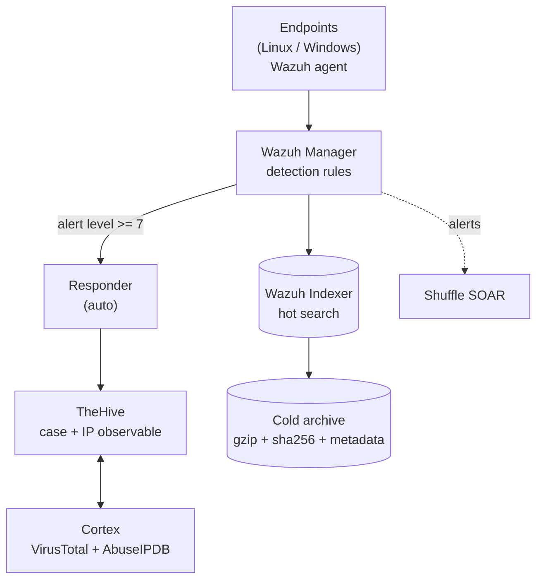
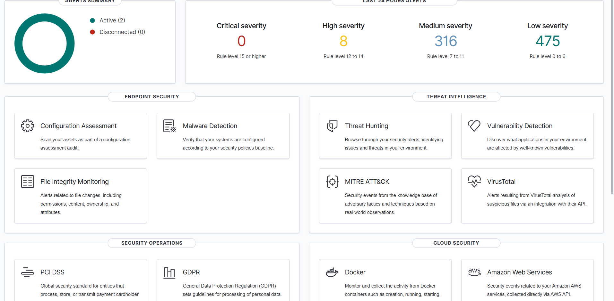
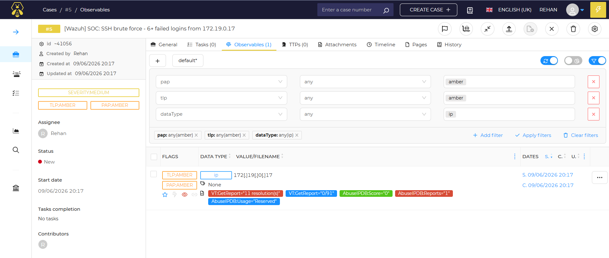
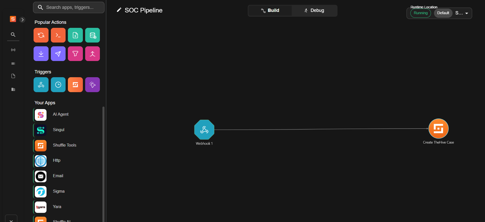
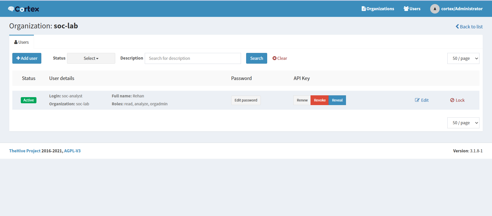

# Automated SOC Lab

A complete, self-hosted **Security Operations Center (SOC)** you can run with Docker.
It detects real attacks on monitored machines, automatically opens investigation
cases, enriches the attacker indicators with threat intelligence, and archives logs
for forensics.

**Stack:** Wazuh (detection/SIEM/EDR) -> Shuffle (SOAR) + auto-responder -> TheHive
(case management) <-> Cortex (threat-intel enrichment) -> forensic log retention.

```
 Endpoints (Linux / Windows, each runs a Wazuh agent)
        |
        v
   Wazuh Manager  --- detects attacks (brute force, suspicious PowerShell, etc.)
        |  (alert level >= 7)
        v
   Responder  ---> TheHive  ----> Cortex (VirusTotal + AbuseIPDB)
   (auto)         case + IP        reputation / verdict
                  observable
        |
        v
   Hot search (Wazuh Indexer)  --->  Cold archive (gzip + sha256 + metadata)
```

---

## Architecture



## Screenshots

**Wazuh dashboard** - 2 agents active (the Ubuntu SSH container + a real Windows 10 laptop) and the last-24h alert counts bucketed by severity, alongside the endpoint-security and threat-intelligence modules.



**TheHive case (auto-created) + Cortex enrichment** - an SSH brute-force alert turned into case #5; the source IP `172.19.0.17` was added as an observable and automatically enriched by Cortex - note the VirusTotal (`VT:GetReport`) and AbuseIPDB (`Score`, `Reports`, `Usage`) verdict tags.



**Shuffle SOAR - "SOC Pipeline" workflow** - the webhook trigger that receives Wazuh alerts, wired to the case-creation step, shown in the Running state.



**Cortex - `soc-lab` organization** - the analyzer service account (roles: read, analyze, orgAdmin) and its API key, which TheHive uses to run the VirusTotal and AbuseIPDB analyzers.



---

## 1. What you need (requirements)

| Requirement | Details |
|---|---|
| **RAM** | **16 GB recommended** (12 GB minimum). The stack uses ~7-8 GB. |
| **Disk** | ~60 GB free |
| **OS** | Windows 10/11, Linux, or macOS |
| **Software** | **Docker** + **Docker Compose v2** (`docker compose version` >= 2.20) |
| **Windows only** | Docker Desktop with the **WSL2 backend** |

### Windows: give Docker enough memory (one time)
Copy the provided `.wslconfig` to your home folder, then restart WSL:
```powershell
copy .wslconfig $env:USERPROFILE\.wslconfig
wsl --shutdown
```

### Linux: raise the kernel map count (needed by the search engines)
```bash
sudo sysctl -w vm.max_map_count=262144
```

---

## 2. Get the code

```bash
git clone https://github.com/Rehan919/Automated-SOC.git
cd Automated-SOC
```

---

## 3. Set your secrets (one time)

Copy the two templates and fill in real values (replace every `CHANGE_ME`):

**Windows (PowerShell):**
```powershell
copy .env.example .env
copy shuffle\.env.example shuffle\.env
```
**Linux/macOS:**
```bash
cp .env.example .env
cp shuffle/.env.example shuffle/.env
```

Open `.env` and `shuffle/.env` in an editor and set strong values. Generate random
secrets with:
```bash
openssl rand -base64 24
```
You will also need free API keys (paste them into `.env`):
- **VirusTotal**: https://www.virustotal.com (Account -> API key)
- **AbuseIPDB**: https://www.abuseipdb.com (Account -> API)

> `CORTEX_API_KEY`, `THEHIVE_API_KEY`, and `SHUFFLE_WEBHOOK_URL` are created **after**
> first boot (Step 6) - leave them as `CHANGE_ME` for now.

---

## 4. Generate TLS certificates + rotate default passwords (one time)

```bash
# create the Wazuh TLS certs
docker compose -f wazuh/generate-indexer-certs.yml run --rm generator

# make the indexer/dashboard passwords match your .env
bash scripts/wazuh-change-passwords.sh
```

---

## 5. Start everything

```bash
docker compose up -d
docker compose ps          # wait until services are "healthy" (first boot pulls images, ~5-10 min)
```

Access the web UIs (all on localhost):

| Service | URL | First login |
|---|---|---|
| Wazuh dashboard | https://localhost (443) | `admin` / your `INDEXER_PASSWORD` |
| TheHive | http://localhost:9000 | `admin@thehive.local` / `secret` (change it) |
| Cortex | http://localhost:9001 | create the admin on first visit |
| Shuffle | http://localhost:3001 | `admin` / your `SHUFFLE_DEFAULT_PASSWORD` |

---

## 6. First-boot configuration (connect the tools)

This wires the three API keys the pipeline needs. Do it once.

**a) Cortex (http://localhost:9001)**
1. Create the admin account, log in.
2. Organizations -> add `soc-lab`.
3. In `soc-lab` -> Users -> create a user with roles **read, analyze, orgAdmin** -> **Create API key** -> copy it.
4. Put it in `.env` as `CORTEX_API_KEY`.
5. Organization -> Analyzers -> enable **VirusTotal_GetReport** and **AbuseIPDB**, pasting your API keys.

**b) TheHive (http://localhost:9000)**
1. Log in `admin@thehive.local` / `secret`, change the password.
2. Create organization `soc-lab` -> add a user -> **Create API key** -> copy it.
3. Put it in `.env` as `THEHIVE_API_KEY`.

**c) Apply the keys**
```bash
docker compose up -d thehive responder    # reload with the new keys
```

**d) Retention policy (optional)**
```bash
bash retention/apply-ism-policy.sh
```

That's it - alerts (level >= 7) now auto-create enriched TheHive cases.

---

## 7. Try it: attack a target and watch a case appear

### Built-in Linux target (no setup)
```powershell
# Windows
.\scripts\attack.ps1                 # SSH brute force against the bundled ubuntu-ssh-target
```
```bash
# Linux/macOS
docker compose --profile attack run --rm attacker
```
Within ~30s a case appears in TheHive (http://localhost:9000) under the `soc-lab`
org, with the attacker IP as an observable you can enrich in Cortex.

### Test detections without attacking
```bash
bash detections/test-events/run-logtest.sh
```

---

## 8. Monitor your OWN machines (add real endpoints)

The manager listens for agents on ports **1514/1515**. Expose them on your LAN
(edit `wazuh/docker-compose.yml` if needed) and open your firewall, then:

**Linux endpoint**
```bash
curl -so wazuh-agent.deb https://packages.wazuh.com/4.x/apt/pool/main/w/wazuh-agent/wazuh-agent_4.9.2-1_amd64.deb
sudo WAZUH_MANAGER="<MANAGER_IP>" dpkg -i ./wazuh-agent.deb
sudo systemctl start wazuh-agent
```

**Windows endpoint** (PowerShell as Admin)
```powershell
msiexec.exe /i wazuh-agent-4.9.2-1.msi /q WAZUH_MANAGER="<MANAGER_IP>" WAZUH_AGENT_NAME="my-pc"
NET START WazuhSvc
```
See `endpoints/windows-sysmon/README.md` to add Sysmon for richer Windows detection.

To attack a remote SSH host you own:
```powershell
.\scripts\attack.ps1 -Target 192.168.1.50 -User root
```

---

## 9. Detections included (detection-as-code)

| Rule | What it catches | Level | MITRE |
|---|---|---|---|
| 100100 | SSH brute force (6+ failed logins / 120s) | 12 | T1110 |
| 100200 | Suspicious PowerShell (Sysmon, needs Windows agent) | 13 | T1059.001 |
| 100300 | Windows logon brute force / password spray | 12 | T1110 |

Plus thousands of Wazuh built-in rules (file integrity, CIS compliance, rootkit
checks, etc.). Rules live in `detections/wazuh-rules/`; Sigma equivalents in
`detections/sigma/`. Edit a rule and `docker compose restart wazuh.manager` to apply.

---

## 10. Useful commands

```bash
docker compose ps                                   # status
docker compose logs -f wazuh.manager                # follow logs
docker exec <manager> /var/ossec/bin/agent_control -l   # list agents
docker compose run --rm retention /archive.sh       # cold-archive logs now
python scripts/unblock.py --list                    # response/block history
docker compose down                                 # stop (keep data)
docker compose down -v                              # stop + WIPE all data
```

---

## 11. Project layout

```
wazuh/         Manager + Indexer + Dashboard, rules, active-response
endpoints/     ubuntu-ssh-target + attacker containers; Windows/Sysmon docs
thehive/       TheHive 5 + Cassandra + Elasticsearch
cortex/        Cortex + analyzer config
shuffle/       Shuffle SOAR stack + workflow logic
responder/     Auto-responder: turns Wazuh alerts into TheHive cases
detections/    Detection-as-code: wazuh-rules, sigma, test-events
retention/     Hot->cold log archive + ISM policy
scripts/       attack launcher, password rotation, response, helpers
documentation/ architecture, runbook, prerequisites, troubleshooting
```

---

## 12. Security notes (read before exposing it anywhere)

- Designed for a **lab/private network**. All ports bind to `127.0.0.1` by default.
- **Do NOT expose the UIs/APIs to the public internet.** These tools have admin
  access and mount the Docker socket. If you need remote access, use a VPN
  (e.g. Tailscale/WireGuard) instead of public ports.
- Rotate **every** credential in `.env` and `shuffle/.env`. Never commit them
  (they are gitignored).
- Destructive response (IP block) is **human-approved**, allowlist-protected,
  logged, and reversible.

---

## 13. Troubleshooting

See `documentation/troubleshooting.md` for common first-run issues (agent
enrollment, manager health, dashboard config) and their fixes.

## License
Provided as-is for educational/lab use.