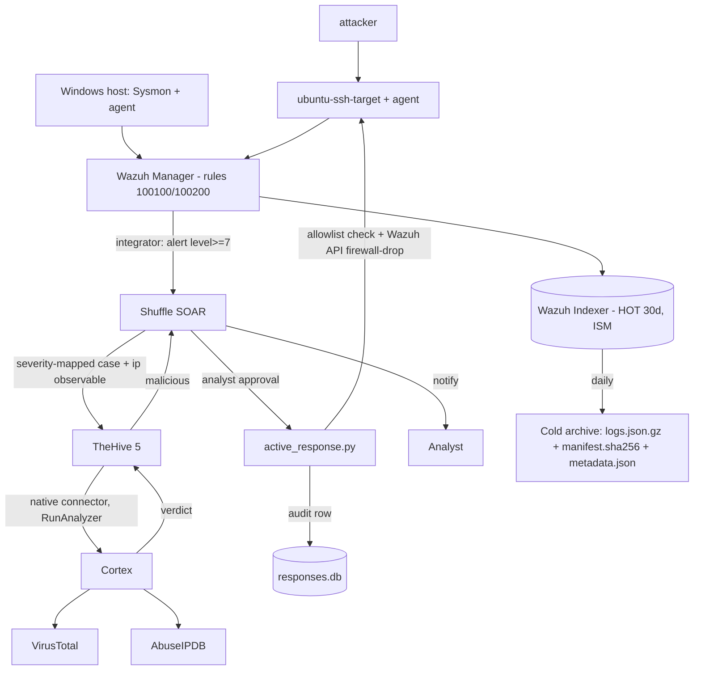

# SOC Automation Lab v2 -- Architecture

## Components (15 services on the `soc-lab` Docker network)
| Component | Services | Host port (127.0.0.1) |
|---|---|---|
| Wazuh | wazuh.manager, wazuh.indexer, wazuh.dashboard | 443 (dashboard), 9200 (indexer), 1514/1515/55000 (manager) |
| Endpoints | ubuntu-ssh-target, attacker (+ Windows host, native) | 2222 (ssh-target) |
| TheHive | thehive, cassandra, elasticsearch | 9000 |
| Cortex | cortex, cortex-elasticsearch | 9001 |
| Shuffle | shuffle-frontend, shuffle-backend, shuffle-orborus, shuffle-opensearch | 3001/3443 (ui), 5001 (api) |
| Retention | retention (cold archive job) | - |

All published ports bind to 127.0.0.1 (lab only). Shuffle OpenSearch is NOT
published (avoids clashing with the Wazuh indexer on 9200).

## Data flow

## Design decisions (and the flaws they fix)
- **Trigger at the Manager** (not the Indexer): alerts originate from the rule
  engine via the integrator; level>=7 filter prevents case flooding.
- **TheHive owns enrichment** via the native Cortex connector; Shuffle never
  calls Cortex -> no duplicate analyzer runs / quota waste (Cortex caches 30m).
- **Human-in-the-loop response**: destructive firewall-drop is gated behind
  analyst approval, an IP allowlist, an accountability DB, and a rollback path.
- **Forensic cold storage**: gzip + SHA-256 manifest + metadata.json, read-only,
  with a documented rehydration procedure; ISM keeps the hot tier to 30 days.
- **Detection-as-code**: version-controlled Wazuh rules + Sigma + test-events.

## Severity mapping (Wazuh level -> TheHive)
7-9 -> Low (1) | 10-12 -> Medium (2) | 13-15 -> Critical (4)

## Security posture (lab)
Localhost-only binds; rotate all default credentials; secrets in gitignored
.env files; do not expose to a public network. Single-host, no HA.